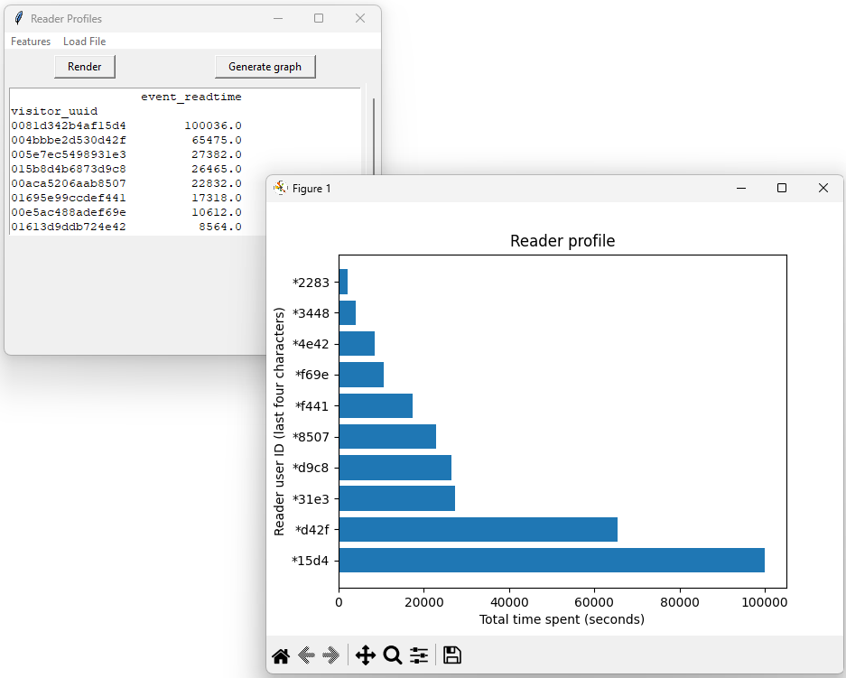
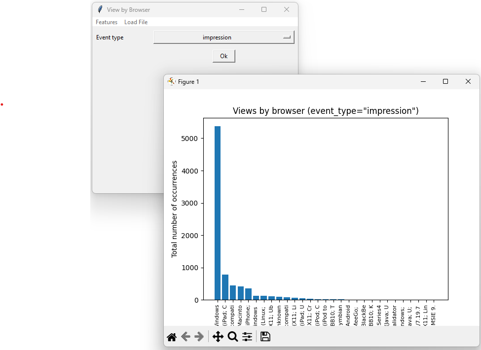
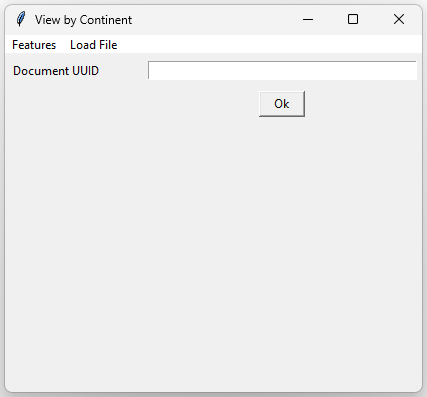

# F21SC_CW2

Python coursework for Industrial Programming

| ###   | ###   |
| :---: | :---: |
|  |  |
|  | and more... Some have an input box for the Document UUID to analyze. |

## Usage

```bash
python ./src/f21sccw2.py        # if you install dependencies with pip
#uv run ./src/f21sccw2.py       # if you install dependencies with uv
#pdm run ./src/f21sccw2.py      # if you install dependencies with pdm
```

## Dependencies

### System Dependencies

- You will need to [install tkinter](https://www.geeksforgeeks.org/how-to-install-tkinter-on-linux/) if you are on linux as it is not provided by default when you install python.
- You will need to [install graphviz](https://graphviz.org/download/)

### Python Library Dependencies

- "graphviz>=0.20.3"
- "matplotlib>=3.9.2"
- "orjson>=3.10.12"
- "pandas>=2.2.3"
- "pycountry-convert>=0.7.2"
- tkinter

To install them, either use pip (don't forget to create a [virtual environment](https://docs.python.org/3/library/venv.html))
```bash
pip install -r ./requirements.txt
```
Or any Python Package Manager like `uv` or `pdm`
```bash
uv sync
#pdm install
```

## Testing

```bash
python ./src/test_model.py
```
